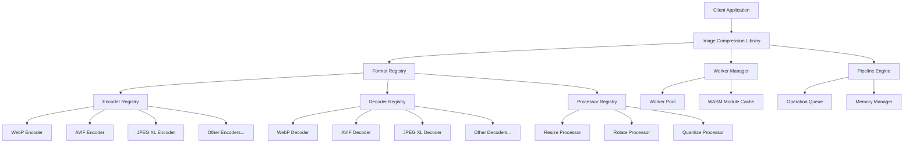

# Design Document

## Overview

The image compression library will extract and refactor the core functionality from Squoosh into a clean, modular TypeScript library. The design follows a plugin-based architecture where different codecs (encoders/decoders) and processors are modular components that can be loaded on-demand. The library will provide both synchronous and asynchronous APIs, with automatic worker management for performance optimization.

The library will be built around three main concepts:

1. **Codecs**: Handle encoding and decoding of specific image formats
2. **Processors**: Apply transformations like resize, rotate, and quantize
3. **Pipeline**: Orchestrate the flow of operations with efficient resource management

## Architecture

### High-Level Architecture



### Core Components

#### 1. Main Library Interface

- **ImageCompressor**: Main class providing the public API
- **ImagePipeline**: Handles chaining of operations
- **FormatDetector**: Automatically detects image formats from buffers

#### 2. Codec System

- **BaseCodec**: Abstract base class for all codecs
- **EncoderRegistry**: Manages available encoders
- **DecoderRegistry**: Manages available decoders
- **CodecLoader**: Handles dynamic loading of codec modules

#### 3. Processing System

- **BaseProcessor**: Abstract base class for image processors
- **ProcessorRegistry**: Manages available processors
- **ProcessorChain**: Handles sequential processing operations

#### 4. Worker Management

- **WorkerManager**: Manages worker lifecycle and pooling
- **WorkerBridge**: Handles communication with workers
- **WasmModuleCache**: Caches loaded WebAssembly modules

## Components and Interfaces

### Core Interfaces

```typescript
// Main library interface
interface ImageCompressor {
  // Format conversion
  convert(
    input: ImageInput,
    targetFormat: ImageFormat,
    options?: EncodeOptions,
  ): Promise<ArrayBuffer>;

  // Decoding
  decode(input: ImageInput): Promise<ImageData>;

  // Encoding
  encode(
    imageData: ImageData,
    format: ImageFormat,
    options?: EncodeOptions,
  ): Promise<ArrayBuffer>;

  // Processing
  process(
    input: ImageInput,
    operations: ProcessingOperation[],
  ): Promise<ImageData>;

  // Pipeline operations
  pipeline(): ImagePipeline;

  // Utility methods
  getSupportedFormats(): SupportedFormats;
  getFormatInfo(format: ImageFormat): FormatInfo;
  detectFormat(buffer: ArrayBuffer): ImageFormat | null;
}

// Pipeline interface for chaining operations
interface ImagePipeline {
  input(source: ImageInput): ImagePipeline;
  decode(): ImagePipeline;
  resize(options: ResizeOptions): ImagePipeline;
  rotate(angle: number): ImagePipeline;
  quantize(options: QuantizeOptions): ImagePipeline;
  encode(format: ImageFormat, options?: EncodeOptions): ImagePipeline;
  execute(): Promise<ArrayBuffer | ImageData>;
}

// Base codec interfaces
interface BaseCodec {
  readonly format: ImageFormat;
  readonly mimeType: string;
  readonly extension: string;
  isSupported(): Promise<boolean>;
}

interface Encoder extends BaseCodec {
  encode(imageData: ImageData, options?: EncodeOptions): Promise<ArrayBuffer>;
  getDefaultOptions(): EncodeOptions;
  validateOptions(options: EncodeOptions): boolean;
}

interface Decoder extends BaseCodec {
  decode(buffer: ArrayBuffer): Promise<ImageData>;
  canDecode(buffer: ArrayBuffer): boolean;
}

// Processor interfaces
interface Processor {
  readonly name: string;
  process(imageData: ImageData, options: ProcessorOptions): Promise<ImageData>;
  validateOptions(options: ProcessorOptions): boolean;
}
```

### Type Definitions

```typescript
type ImageFormat = 'webp' | 'avif' | 'jpeg-xl' | 'png' | 'jpeg' | 'qoi' | 'wp2';

type ImageInput = ArrayBuffer | Uint8Array | Blob | File | ImageData;

interface EncodeOptions {
  quality?: number;
  [key: string]: any; // Format-specific options
}

interface ResizeOptions {
  width: number;
  height: number;
  method?: 'triangle' | 'catrom' | 'mitchell' | 'lanczos3' | 'hqx';
  fitMethod?: 'stretch' | 'contain';
  premultiply?: boolean;
  linearRGB?: boolean;
}

interface QuantizeOptions {
  maxColors: number;
  dither?: number;
}

interface ProcessingOperation {
  type: 'resize' | 'rotate' | 'quantize';
  options: ResizeOptions | number | QuantizeOptions;
}

interface SupportedFormats {
  encoders: ImageFormat[];
  decoders: ImageFormat[];
  processors: string[];
}

interface FormatInfo {
  format: ImageFormat;
  mimeType: string;
  extension: string;
  supportsLossless: boolean;
  supportsTransparency: boolean;
  defaultOptions: EncodeOptions;
}
```

## Data Models

### Image Data Flow


### Worker Communication Model

```typescript
interface WorkerMessage {
  id: string;
  type: 'encode' | 'decode' | 'process';
  payload: {
    operation: string;
    data: ArrayBuffer | ImageData;
    options?: any;
  };
}

interface WorkerResponse {
  id: string;
  success: boolean;
  result?: ArrayBuffer | ImageData;
  error?: string;
  timing?: number;
}
```

### Registry System

```typescript
interface CodecRegistry<T extends BaseCodec> {
  register(codec: T): void;
  unregister(format: ImageFormat): void;
  get(format: ImageFormat): T | undefined;
  getAll(): T[];
  isSupported(format: ImageFormat): Promise<boolean>;
}

interface ProcessorRegistry {
  register(processor: Processor): void;
  unregister(name: string): void;
  get(name: string): Processor | undefined;
  getAll(): Processor[];
}
```

## Error Handling

### Error Types

```typescript
class ImageCompressionError extends Error {
  constructor(message: string, public code: string, public details?: any) {
    super(message);
    this.name = 'ImageCompressionError';
  }
}

// Specific error types
class UnsupportedFormatError extends ImageCompressionError {}
class EncodingError extends ImageCompressionError {}
class DecodingError extends ImageCompressionError {}
class ProcessingError extends ImageCompressionError {}
class WorkerError extends ImageCompressionError {}
class ValidationError extends ImageCompressionError {}
```

### Error Handling Strategy

1. **Input Validation**: Validate all inputs before processing
2. **Graceful Degradation**: Fall back to synchronous processing if workers fail
3. **Resource Cleanup**: Ensure proper cleanup on errors
4. **Detailed Error Messages**: Provide actionable error information
5. **Error Recovery**: Attempt recovery for transient errors

## Testing Strategy

### Unit Testing

- **Codec Tests**: Test each encoder/decoder independently
- **Processor Tests**: Test image processing operations
- **Registry Tests**: Test registration and discovery mechanisms
- **Worker Tests**: Test worker communication and lifecycle

### Integration Testing

- **Pipeline Tests**: Test complete processing pipelines
- **Format Conversion Tests**: Test conversion between all supported formats
- **Performance Tests**: Test memory usage and processing speed
- **Cross-Platform Tests**: Test in Node.js and browser environments

### Test Data Strategy

- **Sample Images**: Curated set of test images in various formats
- **Edge Cases**: Corrupted files, unusual dimensions, extreme compression settings
- **Performance Benchmarks**: Large images for performance testing
- **Format Compliance**: Images that test format-specific features

### Testing Tools

- **Jest**: Primary testing framework
- **Puppeteer**: Browser environment testing
- **Benchmark.js**: Performance testing
- **Custom Utilities**: Image comparison and validation tools

## Performance Considerations

### Memory Management

- **Streaming Processing**: Process images in chunks when possible
- **Buffer Reuse**: Reuse ArrayBuffers to reduce garbage collection
- **Worker Pooling**: Maintain a pool of workers to avoid startup costs
- **WASM Module Caching**: Cache loaded WebAssembly modules

### Optimization Strategies

- **Lazy Loading**: Load codecs only when needed
- **Feature Detection**: Use optimal codecs based on browser capabilities
- **Parallel Processing**: Process multiple images concurrently
- **Progressive Enhancement**: Provide fallbacks for unsupported features

### Browser Compatibility

- **WebAssembly Support**: Graceful fallback for older browsers
- **Worker Support**: Fallback to main thread processing
- **Modern APIs**: Progressive enhancement for newer browser features
- **Bundle Size**: Tree-shaking and code splitting for optimal bundle sizes
